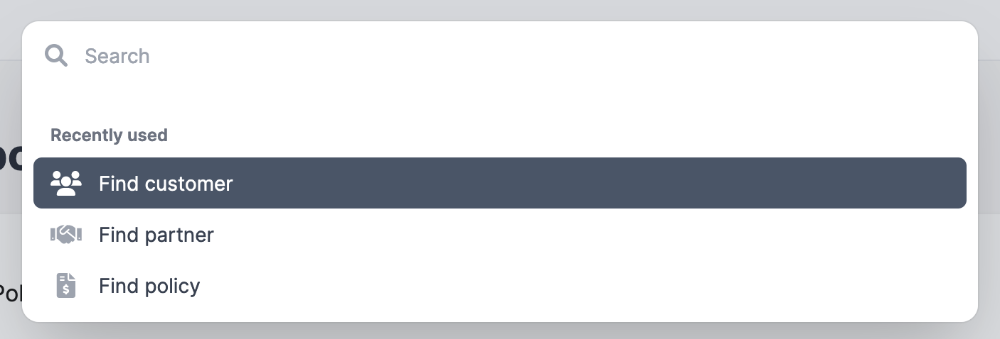
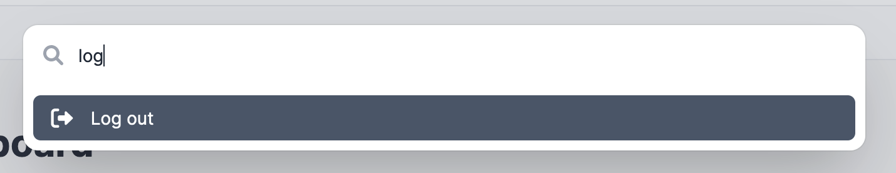
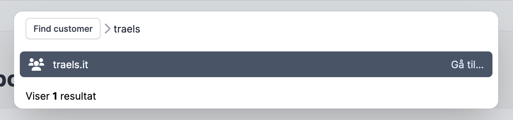

# Kommandant
Do you need a command palette? Would you like to do as little work as possible to get one? Then you've come to the right place!

Kommandant is a command palette engine for Rails. It is built with Hotwire for the slick interaction and Meilisearch as the super-fast search engine.


## Installation

You need to have Meilisearch installed on your system. They have some pretty nice docs describing how right [here.](https://www.meilisearch.com/docs/learn/getting_started/installation)

Kommandant depends on the [meilisearch-rails gem](https://github.com/meilisearch/meilisearch-rails), which needs to be configured:
```ruby
# config/initializers/meilisearch.rb
MeiliSearch::Rails.configuration = {
  meilisearch_url: ENV.fetch("MEILI_HTTP_ADDR") { "http://localhost:7700" },
  meilisearch_api_key: ENV.fetch("MEILI_MASTER_KEY") { "MASTER_KEY" },
  per_environment: true
}
```

Now add this line to your application's Gemfile:

```ruby
gem "kommandant"
```

And then execute:
```bash
bundle
bin/rails generate kommandant:install
```
And you're good to go! However, you might want to configure the gem. As Kommandant has been extracted from one of our apps, we have tailored the default configuration to this app. You might want to turn some stuff off.

```ruby
# config/initializers/kommandant.rb
Kommandant.configure do |config|
  # Commands are a central part of Kommandant. They are loaded from a json file at "config/kommandant/commands.json" by default. We will go into more detail about commands further down the page.
  # config.commands_path = "your/custom/path"
  
  # When meilisearch returns a result, it might include items, that the current user is not allowed to see. You can filter these results with a lamda. This setting has no default, but below is an example that works with cancancan.
  # config.search_result_filter_lambda = ->(current_ability, resource) { current_ability.can?(:show, resource) }
  
  # Another search result filter. We use this to allow admins, who are impersonating users, access to all their commands. This setting has no default.
  # config.admin_only_filter_lambda = ->(current_user, current_admin) { current_user.admin? || current_admin }

  # If you want Kommandant to use a different parent controller, this is the setting for you. Defaults to ApplicationController
  # config :parent_controller = "YourVerySpecialController"
  
  # We assume there is a logged in user and therefore a current_user method. The name of this method can be set here. It defaults to current_user.
  # config.current_user_method = current_account
  
  # If you use Kredis, Kommandant can display the current user's most recently used commands. It requires your user model to have kredis_unique_list called recent_commands. If you don't use Kredis or do not want this behavior, it can be disabled. It defaults to being enabled.
  # class User < ApplicationRecord
  # kredis_unique_list :recent_commands, limit: 5
  # config.recent_commands.enabled = false

  # When a search returns a lot of results, it can be useful to paginate them. We use Pagy by default to handle this. If you do not use Pagy, this functinality can be turned off or configured to suit your needs. It defaults to being enabled.
  # config.pagination.enabled = false
  # config.pagination.items_per_page = 10 # defaults to 10
  # config.pagination.pagination_lambda = ->(results, items, controller) { controller.send(:pagy_array, results, items: items) }
  # config.pagination.info_label_lambda = ->(pagination, controller) { controller.send(:pagy_info, pagination).html_safe }
  # config.pagination.module = "Pagy::Frontend"
  end
end

```

## Usage
### Commands

Commands are the building blocks of the command palette. Any action in the command palette is backed by a command.
Like everything else in the command palette, commands are stored in meilisearch. Unlike everything else commands are **not** backed by a database record.
They are instead defined in a JSON file in your app (Kommandant expects this file to be located at `config/kommandant/commands.json`, but this can be configured. See above).
This file can be indexed in meilisearch by running the following command:
```ruby
Kommandant::Command.reindex!
```

This must be run every time, the file is edited.

#### The basic command


  A basic command is meant to hit a controller without a specific resource. It will mostly be used for simple actions like logging out, toggling some setting or navigation. It requires all the fields below to work as expected.
```json
// The commands should be wrapped in an array, but it is omitted here
{
  "id": "logout",
  "icon": "ban",
  "path": "/logout",
  "http_method": "post",
  "translations": {
    "en": {
      "name": "Log out"
    },
    "da": {
      "name": "Log ud"
    }
  }
}
```

`id` must be unique. It is used as the id in meilisearch and in the controller routes. We usually make it a descriptive string.

`icon` is the name of an icon you want displayed with the command in the command palette. You must supply your own partial at `kommandant/shared/icons/command` to render the icon. This partial is given the icon name in a local called `icon`.

`path` is the path, that the command palette goes to when selected. In the example above, selecting the command will fire a request to the app's logout route. The existing logic takes over and logs the user out in exactly the same way as clicking through the UI.

`http_method` should match http method expected of the controller action, you want to hit.

`translations` use I18n under the hood. You can supply translations for whatever languages you need here.


#### The resource command



Most of your commands will be resource commands. They operate on a database backed model that has been setup to be indexed by meilisearch.
```ruby
class Customer < ApplicationRecord
  include MeiliSearch::Rails

  meilisearch do
    # This makes the customer's id searchable
    attribute :id
    attribute :name do
      # And this lets you find it by its legal_entity association's name
      legal_entity.name
    end
  end

  belongs_to :legal_entity
end
```
*Basic example of indexing a model. For more details see the [meilisearch-rails docs](https://github.com/meilisearch/meilisearch-rails)*

Any time a new model gets a meilisearch configuration or an attribute is modified, meilisearch must be updated.
```ruby
MeiliSearch::Rails::Utilities.reindex_all_models
```

Again all the fields below are required to make the command function as excpected. However this type of command has an extra step. Once the user has selected a resource command, they will be presented with a new search bar, that allows them to search all this resource.
```json
  {
    "id": "find_customer",
    "icon": "users",
    "path": "/kommandant/commands/find_customer",
    "http_method": "get",
    "resource_class": "Customer",
    "text_keys": [
      "name" 
    ],
    "translations": {
      "en": {
        "name": "Find customer",
        "placeholder": "Search for customer name or id"
      }
    }
  }
```
`id`, `icon` and  `http_method` work exactly as for the basic command.

`path` needs to be `/kommandant/commands/[insert command id here]`. This will be set by the gem in a future version.

`resource_class` must be the model you want to search for.

`text_keys` are the indexed values that you want displayed for each hit, when you search the resouce. In the command above it will show the customers name. Several keys can be added and the result will be joined with commas.

`translations` can have an extra keys called placeholders. This does what it says on the tin. It is highly recommended to tell the users what they can search for here.

There are a couple additional fields a command can have.
```json
  {
    "id": "impersonate_user",
    "icon": "user_ninja",
    "path": "/kommandant/commands/impersonate_user",
    "http_method": "get",
    "resource_class": "User",
    "redirect_path": "/become/:id",
    "text_keys": [
      "name"
    ],
    "admin_only": true,
    "translations": {
      "en": {
        "name": "Impersonate user",
        "placeholder": "Search on user's name"
      }
    }
  },
```
`redirect_path` is used when the path cannot be inferred from the model's class name. The path is inferred like this:
```ruby
"/#{command.resource_class.downcase.pluralize}/#{resource.id}"
```

`admin_only` is used to filter out commands that only the admin is allowed to use. The `admin_only_filter_lambda` in the configuration is used here.

#### Setting up the views
Kommandant supplies two Stimulus controllers, `command-palette` and `keyboard-navigation`, containing all the JavaScript necessary to show, hide and navigate the command palette. This requires a `data-controller` attribute that catches all the events nested under its element. We recommend setting this on the body tag of your layout, so that all events are caught.

Stimulus data-action attributes are used to trigger the command palette. There are no default keybindings for this. Instead we utilize the [keyboard event filters](https://stimulus.hotwired.dev/reference/actions#keyboardevent-filter) in Stimulus to trigger the toggle action. You can use this to set any keyboard shortcut you want - as well as trigger it by clicking a button or any other event, you want to display the palette.

```
<body
  data-controller="command-palette keyboard-navigation"
  data-action="keydown.meta+k->command-palette#toggle keydown.ctrl+k->command-palette#toggle keydown.esc->command-palette#hide keydown.down->keyboard-navigation#down keydown.up->keyboard-navigation#up keydown.enter->keyboard-navigation#select">
  ...
</body>
```

## Tasks
The gem comes with several tasks for reindexing and clearing the search engine. You will probably use `rails kommandant:reindex` the most. We recommend you run this on every deploy to make sure the search engine contains the data you expect.

```
rails kommandant:clear_command_index                 # Clears the Kommandant commands from the search engine
rails kommandant:clear_indexes                       # Clears the search engine of all commands and models
rails kommandant:clear_model_index                   # Clears the search engine of all models set up with Kommandant
rails kommandant:install:migrations                  # Copy migrations from kommandant to application
rails kommandant:reindex                             # Reindexes all commands and models
rails kommandant:reindex_commands                    # Reindexes all commmands defined in the commands json file (or w...
rails kommandant:reindex_models                      # Reindexes all models set up with Kommandant
```

## Future improvements
We will continue to improve this gem. Some of the things on the planning board are:
- Install task that generates both a default config and commands file
- Database-backed commands
- Support for navigation commands
- Default paths for resource commands
- Build own macros for indexing models in meilisearch
- Optional command icons
- A default icon set and partial (probably [heroicons](https://heroicons.com/))
- Generate views task

## Things that (probably) won't happen
- Different search backends, like ElasticSearch. We don't need it ourselves, so we don't want the maintenance overhead. But we will welcome PRs that supply this as a plugin somehow! 
- Optional translations. We use translations in all our projects. If you hate having to supply translations, PRs are welcome.


## Contributing
Contributions are welcome. We expect you to treat others well.

## License
The gem is available as open source under the terms of the [MIT License](https://opensource.org/licenses/MIT).
